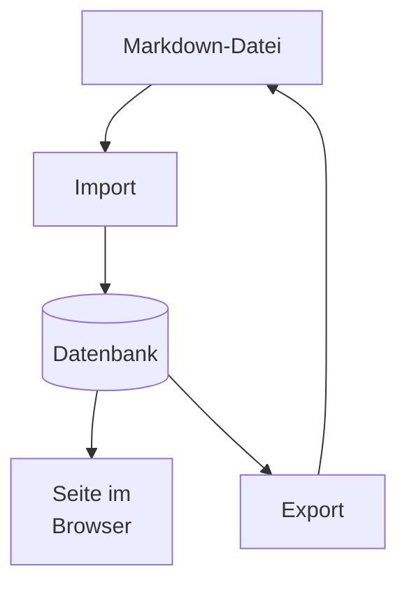

# Was schon geht

Diese Seite ist der Beweis. Jeder Absatz hier wurde aus einer Markdown-Datei
gelesen, in Blöcke umgewandelt, in einer Datenbank gespeichert und wieder
gerendert.

## Überschriften bauen die Gliederung

Rechts (oder unten auf dem Handy) steht ein Inhaltsverzeichnis. Es wird nicht von
Hand gepflegt, sondern beim Lesen aus den Überschriften gewonnen.

### Auch verschachtelt

Die Ebene wird mitgeführt und im Inhaltsverzeichnis eingerückt.

## Listen

- Aufzählungen funktionieren
- Auch mit mehreren Punkten
- Die Reihenfolge bleibt erhalten

1. Nummerierte Listen ebenso
2. Zweiter Punkt
3. Dritter Punkt

## Zitate

> Ein Zitat wird als eigener Blocktyp gespeichert, nicht als Absatz mit
> besonderem Aussehen. Das ist der Unterschied zwischen Struktur und Formatierung.

## Code

```rust
pub fn slugify(input: &str) -> String {
    // Deutsche Zeichen werden VOR der ASCII-Faltung ersetzt.
    // Sonst wird aus "Präbiotika" das unbrauchbare "pr-biotika".
}
```

## Formeln

Ein Codeblock mit der Sprache math wird nicht abgedruckt, sondern gesetzt — und zwar
beim Seitenaufbau auf dem Server. Im Browser läuft dafür nichts: mit abgeschaltetem
JavaScript steht die Formel genauso da.

```math
\mathrm{eGFR} = 141 \cdot \left(\frac{S_\mathrm{Kr}}{\kappa}\right)^{\alpha} \cdot 0{,}993^{\text{Alter}}
```

## Diagramme

Ein Codeblock mit der Sprache mermaid wird gezeichnet. Das passiert im Browser und
nicht auf dem Server — anders als bei den Formeln, denn der Zeichner braucht dafür
die Seite selbst. Ohne JavaScript steht hier deshalb der Quelltext des Diagramms.

Gezeichnet wird zweimal, einmal hell und einmal dunkel; ein Bild kann der
Farbeinstellung nicht folgen, also liegen beide bereit und das Stylesheet zeigt das
passende.

Ein `<br>` in einer Beschriftung bricht die Zeile um — das steht hier absichtlich im
Beispiel, weil genau dieser Fall lange ein kaputtes Bild ergeben hat.



## Wo die Grenze liegt

**Fett** und *kursiv* siehst du hier nicht — der Text bleibt erhalten, die
Auszeichnung wird noch verworfen. Das Ladeprogramm sagt das beim Import auch
ausdrücklich, statt es stillschweigend zu tun.
